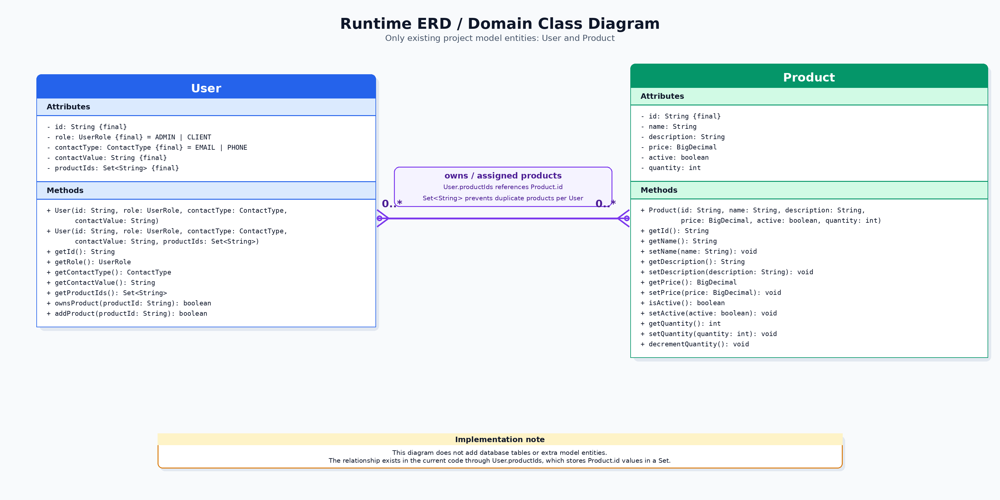

# Online Shopping Store

Spring Boot REST API for managing users, authentication, products, and product purchases. The application allows clients to register and authenticate by ID and contact method, view active products, buy products, and see their assigned products. Admin users can create products, update product details, manage product quantity, and activate or deactivate products.

## ERD / Domain Model



This diagram represents the main domain relationship between `User` and `Product`.
A user can be assigned multiple products, and the same product can belong to multiple users.
Each client can have each product only once.
The relationship is represented in the current model by storing product IDs on the user side, while product details are managed by the `Product` model.

## Run

Requirements: Java 17+ and Maven.

```bash
mvn spring-boot:run
```

Swagger UI:

```text
http://localhost:8080/swagger-ui.html
```

Run tests:

```bash
mvn test
```


## Main Endpoints

- `POST /api/users/clients`: create CLIENT user
- `POST /api/auth/login`: login ADMIN or CLIENT
- `POST /api/products`: create Product
- `PATCH /api/products/{productId}/description`: update description
- `PATCH /api/products/{productId}/price`: update price
- `PATCH /api/products/{productId}/quantity`: update quantity
- `PATCH /api/products/{productId}/deactivate`: deactivate Product
- `PATCH /api/products/{productId}/activate`: activate Product
- `GET /api/products/active`: list active Products
- `POST /api/products/{productId}/buy`: buy Product
- `GET /api/products/my-products`: list Products assigned to the authenticated CLIENT

## Main API cURL Examples

The application starts with initial runtime data, including `admin-1` and `client-1`.
Login returns a JWT token.
Use the returned token as a Bearer token for protected endpoints.

### Create CLIENT user

```bash
curl -X POST http://localhost:8080/api/users/clients \
  -H "Content-Type: application/json" \
  -d '{
    "userId": "client-3",
    "contactType": "EMAIL",
    "contactValue": "client3@example.com"
  }'
```

### Login as ADMIN

```bash
curl -X POST http://localhost:8080/api/auth/login \
  -H "Content-Type: application/json" \
  -d '{
    "userId": "admin-1",
    "contactType": "EMAIL",
    "contactValue": "admin@example.com"
  }'
```

Use the returned `token` value:

```bash
ADMIN_JWT="<admin-token>"
```

### Login as CLIENT

```bash
curl -X POST http://localhost:8080/api/auth/login \
  -H "Content-Type: application/json" \
  -d '{
    "userId": "client-1",
    "contactType": "EMAIL",
    "contactValue": "client1@example.com"
  }'
```

Use the returned `token` value:

```bash
CLIENT_JWT="<client-token>"
```

### Create Product

```bash
curl -X POST http://localhost:8080/api/products \
  -H "Authorization: Bearer $ADMIN_JWT" \
  -H "Content-Type: application/json" \
  -d '{
    "id": "prod-keyboard",
    "name": "Keyboard",
    "description": "Mechanical keyboard",
    "price": 89.99,
    "quantity": 7
  }'
```

### Update Product description

```bash
curl -X PATCH http://localhost:8080/api/products/prod-keyboard/description \
  -H "Authorization: Bearer $ADMIN_JWT" \
  -H "Content-Type: application/json" \
  -d '{
    "description": "Wireless mechanical keyboard"
  }'
```

### Update Product price

```bash
curl -X PATCH http://localhost:8080/api/products/prod-keyboard/price \
  -H "Authorization: Bearer $ADMIN_JWT" \
  -H "Content-Type: application/json" \
  -d '{
    "price": 79.99
  }'
```

### Update Product quantity

```bash
curl -X PATCH http://localhost:8080/api/products/prod-keyboard/quantity \
  -H "Authorization: Bearer $ADMIN_JWT" \
  -H "Content-Type: application/json" \
  -d '{
    "quantity": 12
  }'
```

### Deactivate Product

```bash
curl -X PATCH http://localhost:8080/api/products/prod-keyboard/deactivate \
  -H "Authorization: Bearer $ADMIN_JWT"
```

### Activate Product

```bash
curl -X PATCH http://localhost:8080/api/products/prod-keyboard/activate \
  -H "Authorization: Bearer $ADMIN_JWT"
```

### List active Products

```bash
curl -X GET http://localhost:8080/api/products/active \
  -H "Authorization: Bearer $CLIENT_JWT"
```

### Buy Product

```bash
curl -X POST http://localhost:8080/api/products/prod-headphones/buy \
  -H "Authorization: Bearer $CLIENT_JWT"
```

### List authenticated CLIENT Products

```bash
curl -X GET http://localhost:8080/api/products/my-products \
  -H "Authorization: Bearer $CLIENT_JWT"
```

## Example Client Purchase Test Flow

Use this flow to test the main client purchase scenario from start to finish.
Start the application first with `mvn spring-boot:run`.

### 1. Create a CLIENT user

```bash
curl -X POST http://localhost:8080/api/users/clients \
  -H "Content-Type: application/json" \
  -d '{
    "userId": "test-client",
    "contactType": "EMAIL",
    "contactValue": "test-client@example.com"
  }'
```

### 2. Login with the CLIENT user

```bash
curl -X POST http://localhost:8080/api/auth/login \
  -H "Content-Type: application/json" \
  -d '{
    "userId": "test-client",
    "contactType": "EMAIL",
    "contactValue": "test-client@example.com"
  }'
```

Copy the `token` value from the response:

```bash
CLIENT_JWT="<client-token>"
```

### 3. View active products

```bash
curl -X GET http://localhost:8080/api/products/active \
  -H "Authorization: Bearer $CLIENT_JWT"
```

### 4. Buy a product

```bash
curl -X POST http://localhost:8080/api/products/prod-headphones/buy \
  -H "Authorization: Bearer $CLIENT_JWT"
```

### 5. Verify assigned products

```bash
curl -X GET http://localhost:8080/api/products/my-products \
  -H "Authorization: Bearer $CLIENT_JWT"
```

The response should include the product that was bought.
Each client can buy each product only once; buying the same product again returns a conflict error.

## Postman Collection

The repository includes a Postman collection for testing the API:

`postman/online-shopping-store.postman_collection.json`

### How to run the collection

1. Start the Spring Boot application.
2. Open Postman.
3. Click **Import**.
4. Select `postman/online-shopping-store.postman_collection.json`.
5. Set the base URL to `http://localhost:8080` if needed.
6. Run a login request first to receive a JWT token.


## Error Format

Errors are returned consistently:

```json
{
  "timestamp": "2026-05-19T12:00:00Z",
  "status": 409,
  "errorCode": "PRODUCT_ALREADY_OWNED",
  "message": "Client already owns product: prod-headphones"
}
```
